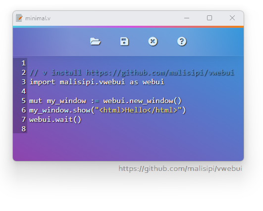

# V-WebUI

Use any web browser as GUI, with V in the backend and HTML5 in the frontend, all in a lightweight portable lib.

## Features

- Fully Independent (*No need for any third-party runtimes*)
- Lightweight (*~900 Kb*) & Small memory footprint
- Fast binary communication protocol between WebUI and the browser (*Instead of JSON*)
- Multi-platform & Multi-Browser
- Using private profile for safety

## Screenshot

This [text editor example](https://github.com/malisipi/vwebui/tree/main/examples/text-editor) is written in V using WebUI as the GUI library.

## Installation

Run `v install malisipi.VWebUI` or `v install https://github.com/malisipi/vwebui`

## Documentation

 - [Online Documentation - V](https://webui.me/docs/#/v_api)

## Supported Web Browsers

| OS | Browser | Status |
| ------ | ------ | ------ |
| Windows | Mozilla Firefox | ✔️ |
| Windows | Google Chrome | ✔️ |
| Windows | Microsoft Edge | ✔️ |
| Windows | Chromium | ✔️ |
| Windows | Yandex | ✔️ |
| Windows | Brave | ✔️ |
| Windows | Vivaldi | ✔️ |
| Windows | Epic | ✔️ |
| Windows | Opera | *coming soon* |
| - | - | - |
| Linux | Mozilla Firefox | ✔️ |
| Linux | Google Chrome | ✔️ |
| Linux | Microsoft Edge | ✔️ |
| Linux | Chromium | ✔️ |
| Linux | Yandex | ✔️ |
| Linux | Brave | ✔️ |
| Linux | Vivaldi | ✔️ |
| Linux | Epic | *Does Not Exist* |
| Linux | Opera | *coming soon* |
| - | - | - |
| macOS | Mozilla Firefox | ✔️ |
| macOS | Google Chrome | ✔️ |
| macOS | Microsoft Edge | ✔️ |
| macOS | Chromium | ✔️ |
| macOS | Yandex | ✔️ |
| macOS | Brave | ✔️ |
| macOS | Vivaldi | ✔️ |
| macOS | Epic | ✔️ |
| macOS | Apple Safari | *coming soon* |
| macOS | Opera | *coming soon* |

### License

> Licensed under MIT License.

### Original Library

> This is just a wrapper written in/for V. Thanks to [WebUI](https://github.com/alifcommunity/webui)
